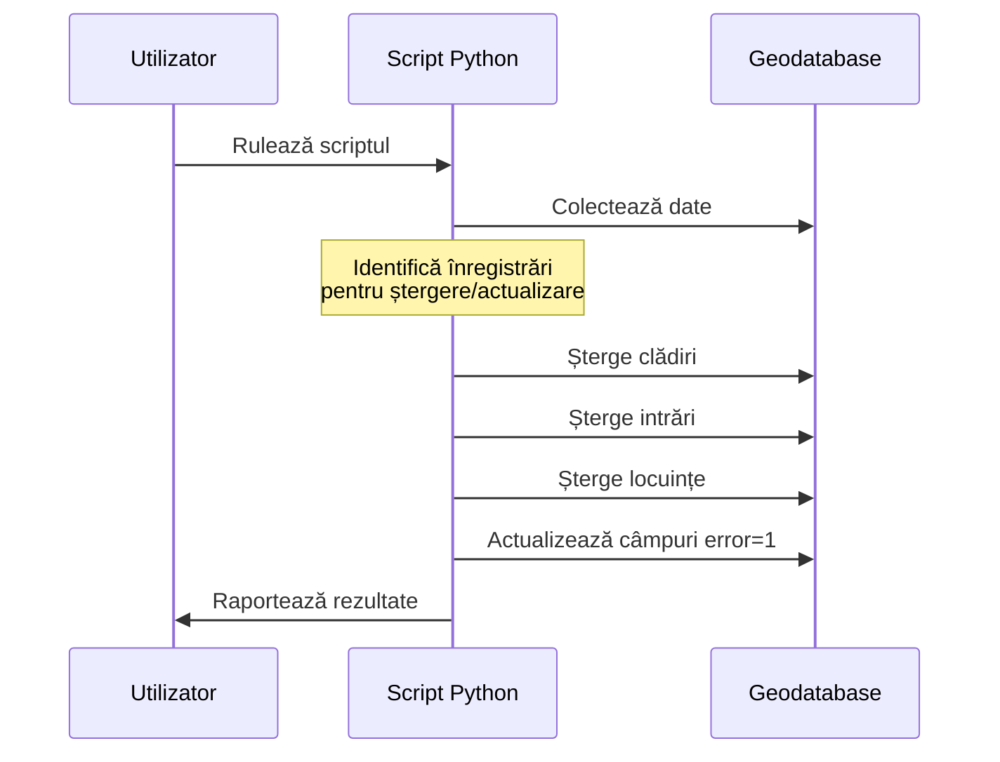
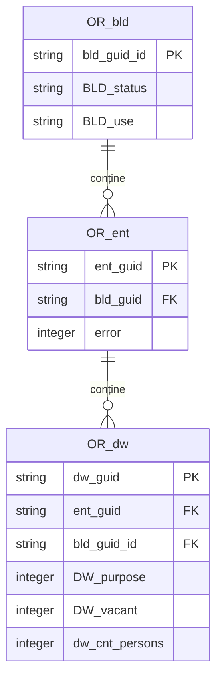
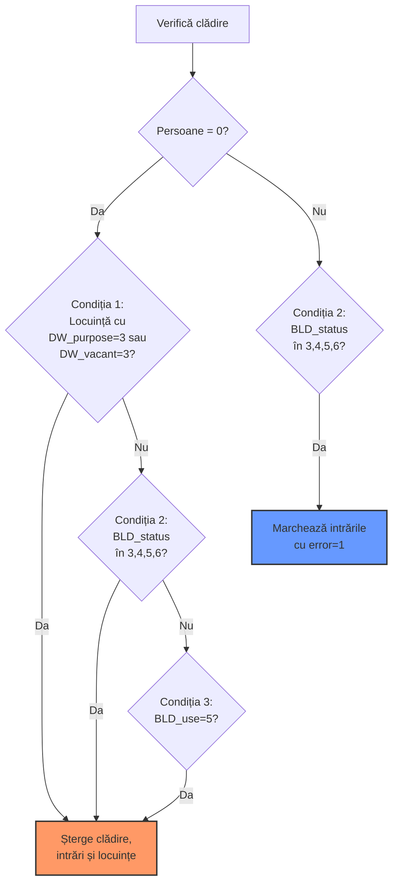
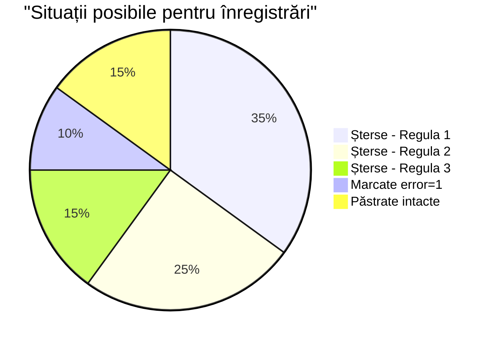
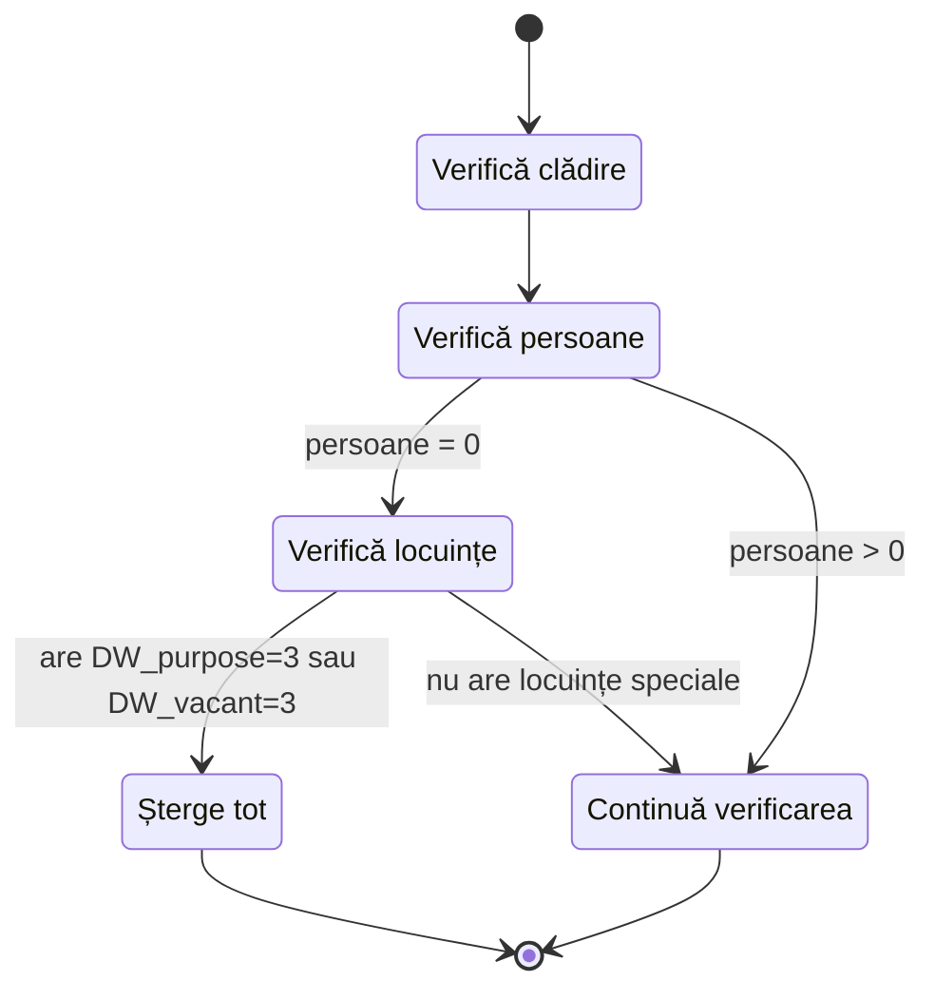
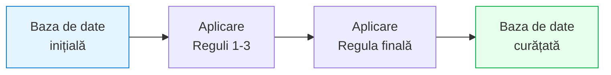
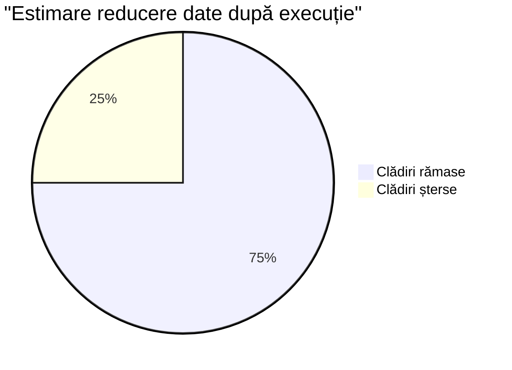

# 🧹 Curățarea datelor în baza geodatabase
## Script: delete_validate_records.py

---

## 🎯 Ce face acest script?

> [!tip] Scop principal
> Acest script identifică și șterge **înregistrări invalide** din baza de date geografice pentru:
> - Clădiri
> - Intrări
> - Locuințe

^scopPrincipal

---

## 🤔 De ce avem nevoie de acest script?

> [!info] Beneficii
> - Elimină clădirile abandonate sau nelocuite
> - Curăță datele pentru analize statistice mai precise
> - Marchează cazuri problematice pentru verificare manuală

> [!example] Exemplu
> Clădirile cu stare '5' (demolată) nu ar trebui să apară în analizele statistice ale populației.

---

## ⚙️ Cum funcționează?

> [!abstract] Proces
> Script-ul folosește pachetul `arcpy` pentru a:
>
> 1. Colecta datele din tabelele GDB
> 2. Aplica reguli de validare
> 3. Șterge înregistrările care îndeplinesc criteriile specifice
> 4. Marchează cazurile speciale cu un flag de eroare

```python
# Fragment de cod simplificat
bld_details, ent_details, dw_details = gather_data(...)
blds_to_delete, ents_to_delete, dws_to_delete = identify_features(...)
execute_changes(blds_to_delete, ents_to_delete, dws_to_delete, ...)
```



---

## 📊 Date utilizate

> [!info] Surse de date
> Scriptul lucrează cu aceste 3 seturi de date în Geodatabase:

| Tip | Nume în GDB | Descriere |
|-----|-------------|-----------|
| Feature Class | `OR_bld` | Clădiri |
| Feature Class | `OR_ent` | Intrări |
| Tabel | `OR_dw` | Locuințe |

> [!quote] Notă importantă
> Scriptul presupune că relațiile dintre tabele sunt stabilite corect prin câmpuri GUID.

$$\text{Clădire} \xrightarrow{\text{1:n}} \text{Intrare} \xrightarrow{\text{1:n}} \text{Locuință}$$



---

## 🔑 Câmpuri importante

> [!info] Structura datelor
> 
> - **ID-uri de legătură**: 
>   - `bld_guid_id`
>   - `bld_guid`
>   - `ent_guid`
> 
> - **Câmpuri de stare**:
>   - `BLD_status` (Starea clădirii)
>   - `BLD_use` (Utilizarea clădirii)
>   - `DW_purpose` (Destinația locuinței)
>   - `DW_vacant` (Starea de ocupare) 
>   - `dw_cnt_persons` (Numărul de persoane)

<details>
<summary>Valori pentru BLD_status</summary>

| Valoare | Descriere |
|---------|-----------|
| 1 | În folosință |
| 2 | În construcție |
| 3 | Abandonată |
| 4 | Parțial demolată |
| 5 | Demolată |
| 6 | Distrusă |

</details>

---

## 🔄 Reguli de ștergere





---

## 🏚️ Regula 1: Locuințe nelocuite

> [!note] Condiția 1
> - **Verifică**: Clădiri unde suma `dw_cnt_persons` este zero
> - **Declanșator**: Cel puțin o locuință are `DW_purpose = 3` SAU `DW_vacant = 3`
> - **Acțiune**: Șterge clădirea, toate intrările și toate locuințele asociate

> [!success] Beneficiu
> Eliminarea completă a înregistrărilor pentru clădiri nelocuite cu statut special.

Formal, o clădire $B$ va fi ștearsă dacă:
$$\sum_{d \in D_B} \text{persons}(d) = 0 \land \exists d \in D_B : (\text{purpose}(d) = 3 \lor \text{vacant}(d) = 3)$$

unde $D_B$ reprezintă mulțimea locuințelor asociate clădirii $B$.



---

## 🏗️ Regula 2: Clădiri cu stare specială

> [!note] Condiția 2
> - **Verifică**: Clădiri unde `BLD_status` este '3', '4', '5', sau '6'
> - **Cazul 2.1**: Dacă `dw_cnt_persons` total = 0 → Șterge tot
> - **Cazul 2.2**: Dacă `dw_cnt_persons` > 0 → Marchează doar intrările cu `error = 1`

> [!question] De ce marcăm cu error=1?
> Acest caz indică o discrepanță: o clădire este marcată ca abandonată/demolată, dar datele arată persoane locuind acolo.
> Trebuie verificat manual dacă:
> - Starea clădirii este greșită
> - Numărul de persoane este greșit

Definim formal:
$$\text{status\_special}(B) = \begin{cases}
\text{șterge tot}, & \text{dacă } \text{BLD\_status}(B) \in \{3,4,5,6\} \land \sum_{d \in D_B} \text{persons}(d) = 0 \\
\text{marchează intrări}, & \text{dacă } \text{BLD\_status}(B) \in \{3,4,5,6\} \land \sum_{d \in D_B} \text{persons}(d) > 0
\end{cases}$$

---

## 🏢 Regula 3: Clădiri cu utilizare specială

> [!note] Condiția 3
> - **Verifică**: Clădiri unde `BLD_use` este '5'
> - **Declanșator**: `dw_cnt_persons` total = 0
> - **Acțiune**: Șterge clădirea, toate intrările și toate locuințele asociate

> [!danger] Atenție
> Valoarea `BLD_use = 5` reprezintă o utilizare incompatibilă cu locuirea!

---

## 🧽 Curățare finală a locuințelor

> [!important] Regula finală
> După aplicarea regulilor 1-3, scriptul mai face o verificare:
> - Șterge orice locuință rămasă care are:
>   - (`DW_purpose = 3` SAU `DW_vacant = 3`) 
>   - ȘI `dw_cnt_persons = 0`

> [!bug] Problemă rezolvată
> Această curățare finală elimină locuințele nelocuite care ar fi putut rămâne după aplicarea regulilor anterioare.



---

## 🛠️ Procesul tehnic

> [!abstract] Etape de execuție
> 
> 1. **Inițializare**: Verifică existența GDB, straturilor și tabelelor
> 2. **Colectare date**: Citește datele relevante în dicționare Python
> 3. **Identificare**: Aplică regulile și identifică înregistrările de șters/actualizat
> 4. **Execuție**: Șterge înregistrările sau actualizează câmpul de eroare

Calcularea persoanelor pentru o clădire:
$$\text{total\_persons}(B) = \sum_{d \in D_B} \text{persons}(d)$$

<details>
<summary>Cod Python pentru execuția schimbărilor</summary>

```python
def execute_changes(arcpy, bld_path, ent_path, dw_path, 
                   blds_to_delete, ents_to_delete, 
                   dws_to_delete, ents_to_update):
    # Creează views și layers temporare
    dw_view = "dw_temp_view"
    ent_layer = "ent_temp_layer"
    bld_layer = "bld_temp_layer"
    
    arcpy.MakeTableView_management(dw_path, dw_view)
    arcpy.MakeFeatureLayer_management(ent_path, ent_layer)
    arcpy.MakeFeatureLayer_management(bld_path, bld_layer)
    
    # Șterge înregistrări
    # ... cod pentru ștergere ...
    
    # Actualizează câmpuri error=1
    # ... cod pentru actualizare ...
```

</details>

---

## 📈 Rezultate așteptate

După executarea scriptului:

- [x] Clădiri abandonate sau fără persoane → șterse
- [x] Intrări problematice → marcate cu `error = 1`
- [x] Locuințe nepopulate cu status special → șterse

> [!success] Rezultat final
> O bază de date curățată, cu informații consistente și pregătită pentru analiză!

Dacă notăm cu $B$ mulțimea tuturor clădirilor, iar cu $B'$ mulțimea clădirilor după execuția scriptului, atunci:

$$B' = \{b \in B | \neg(\text{criteriu\_ștergere}(b))\}$$

unde $\text{criteriu\_ștergere}(b)$ reprezintă îndeplinirea uneia dintre condițiile de ștergere.



---

## ⚠️ Important!

> [!warning] Atenție
> - Scriptul modifică datele **PERMANENT**
> - **ÎNTOTDEAUNA** creați o copie de rezervă a bazei de date înainte de a rula acest script!
> - Scriptul trebuie rulat într-un mediu Python cu ArcGIS (ArcGIS Pro)

> [!failure] Posibile probleme
> - Lipsa drepturilor de scriere în GDB
> - Erori de relație între tabele
> - Câmpuri lipsă sau redenumite

---

## 📝 Sumar

> [!abstract]- Scopul scriptului
> [[#^scopPrincipal]]

> [!tip]- Beneficii principale
> 1. Eliminarea înregistrărilor invalide
> 2. Curățarea datelor pentru analiză
> 3. Marcarea inconsistențelor pentru verificare

> [!question]- Cum pot rula scriptul?
> ```bash
> cd /path/la/script
> C:\Program Files\ArcGIS\Pro\bin\Python\envs\arcgispro-py3\python.exe delete_validate_records.py
> ```

Timpii de execuție estimați în funcție de dimensiunea bazei de date:
| Mărime BD | Nr. clădiri | Nr. intrări | Nr. locuințe | Timp execuție |
|-----------|-------------|-------------|--------------|---------------|
| Mică | $< 10^3$ | $< 10^3$ | $< 10^3$ | $t < 1$ min |
| Medie | $10^3 - 10^4$ | $10^3 - 10^4$ | $10^3 - 10^4$ | $1 \leq t < 5$ min |
| Mare | $10^4 - 10^5$ | $10^4 - 10^5$ | $10^4 - 10^5$ | $5 \leq t < 15$ min |
| Foarte mare | $> 10^5$ | $> 10^5$ | $> 10^5$ | $t \geq 15$ min |

---

## ❓ Întrebări?

![[question_mark.jpg]] 
